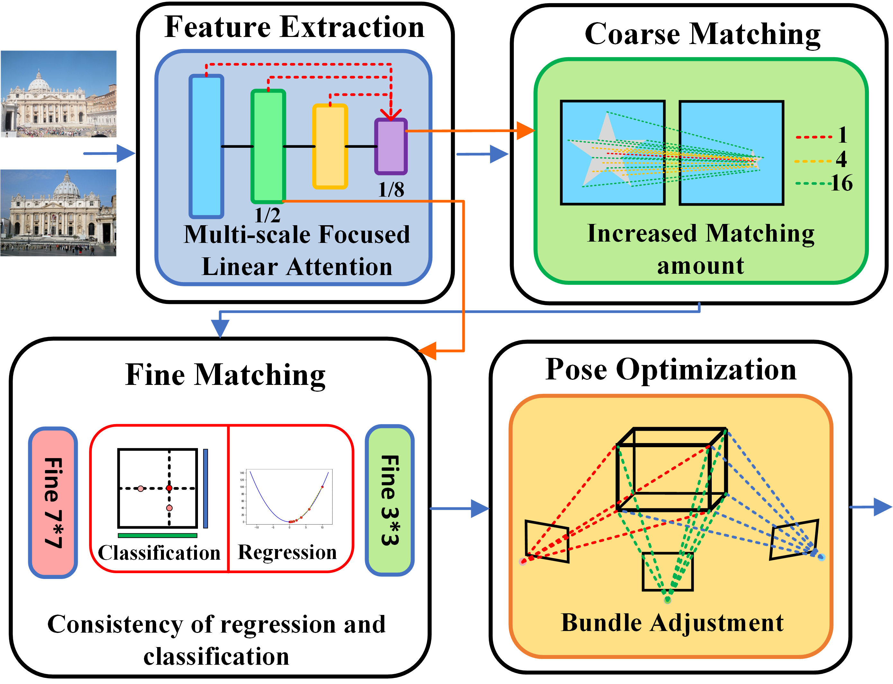
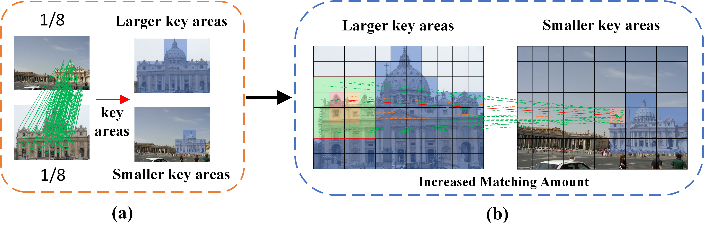

# IMAMatch

### Semi-dense Feature matching with Increased Matching Amount
Yide Di†, Yun Liao†, Yunan Liu*, Kaijun Zhu, Mingyu Lu*, Qing Duan and Junhui Liu

### Introduction

This is a novel approach that selectively enhances match density in critical image regions, substantially improving matching accuracy. By employing a multi-scale focused linear attention mechanism, IMAmatch effectively captures richer feature representations, and densifies correspondences specifically in key areas. Matches are further refined through a consistency verification between regression and classification outputs. Additionally, the method incorporates a differentiable bundle adjustment-based strategy to optimize relative pose estimation. Comprehensive evaluations across multiple datasets indicate that IMAmatch achieves comparable accuracy to state-of-the-art dense matching methods, while offering significantly faster inference speed and lower memory consumption.

局部图像特征匹配是低层视觉中的一项基础任务，近年来得到了广泛研究。然而，半稠密方法在粗匹配阶段常常面临匹配数量不足的问题，而稠密方法虽然覆盖更全面，但需要大量计算资源，且效率较低。为了解决这些局限性，我们提出了IMAmatch（Increased Matching Amount Semi-Dense Matching），一种新颖的匹配方法，通过在关键图像区域有选择性地增加匹配数量，显著提升匹配精度。IMAmatch通过多尺度聚焦线性注意力机制提升特征提取效果，并通过在关键区域增加匹配点密度来提高匹配准确性。随后，结合回归与分类输出之间的一致性检查对匹配结果进行进一步优化。最后，IMAmatch采用基于束调整的可微分相对位姿估计策略进行整体优化。大量在多个数据集上的实验证明，IMAmatch在保持高内存效率和较快推理速度的同时，达到了可与稠密匹配方法媲美的性能水平。

<div align="center">


</div>

### News
- [04/2025] We are currently submitting this paper to **The Visual Computer**.
- 该论文目前正投稿至 **The Visual Computer**.

### Installation

```bash
conda create -n IMAMatch python=3.10
conda activate IMAMatch
cd /path/to/IMAMatch
pip install -r requirement.txt
```

### Datasets

We use the same train/test dataset as [LoFTR](https://github.com/zju3dv/LoFTR/blob/master/docs/TRAINING.md).
place the dataset and index in the data directory.
A structure of dataset should be:

```
megadepth_root_dir
├── phoenix
├── Undistorted_SfM
└── megadepth_indices

scannet_root_dir
├── scannet_test_1500
├── scannet_all
│   ├── scene0000_00
│   ├── ...
│   └── scene0806_00
└── scanent_indices   
     ├── intrinsics.npz
     └── scene_data
```
Then set your megadepth_root_dir and scannet_root_dir in configs/data_config.py


### Train and Evaluation

For both train and evaluation, you can just excute the corresponding scripts. To set the parameters, just modity the cfg dict inner the script. 

### demo pair


### Acknowledgments

Our work is based on [LoFTR](https://github.com/zju3dv/LoFTR) and we use their code.  We appreciate the previous open-source repository [LoFTR](https://github.com/zju3dv/LoFTR).
